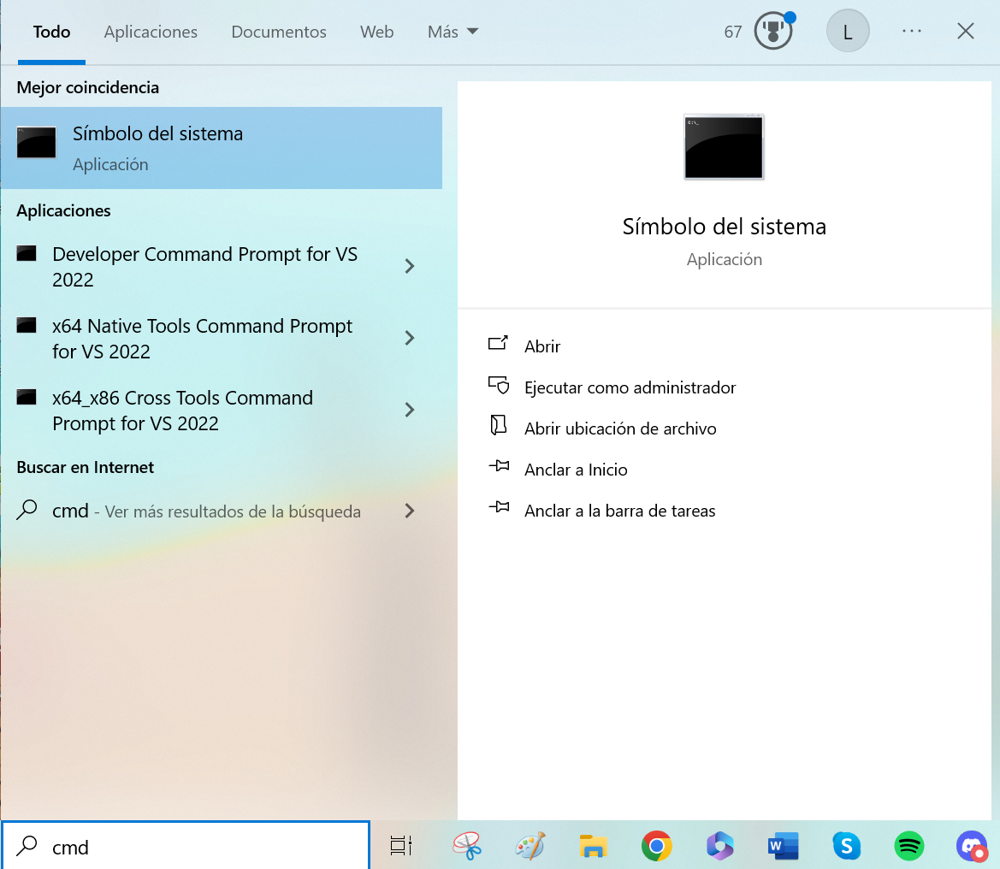
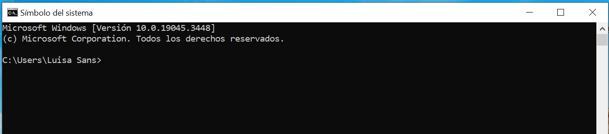
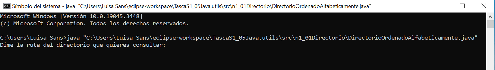
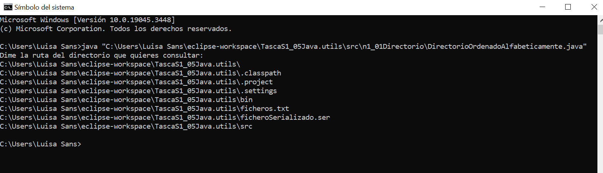

# TascaS1_05Java.utils

## Java Utils
 
**Cómo ejecutar el programa desde la línea de comandos:**

1.	Ir a la sección Buscar en la barra inferior izquierda en Windows y poner cmd:

2.	Aparecerá una pantalla negra:

 

3.	Aquí introduciremos la ruta donde esté nuestro programa a ejecutar (importante escribir la ruta entre comillas): 

 

4.	Ahora ya podemos introducir la ruta que queramos para que nos la ordene alfabéticamente:
   
 

6.	Repetir pasos de 1 a 4 para los ejercicios:

n1_02DirectorioRecursivo, cambiar el fichero a \DirectorioRecursivo.java

n1_03Imprimirentxt, cambiar el fichero a \RecursivoenTxt.java

n1_04LeerTxt, cambiar el fichero a \LeerTxt.java

